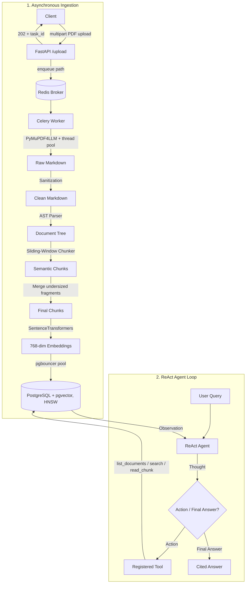

# Agentic RAG Pipeline

[](https://github.com/omega-sus67/rag_python/actions/workflows/ci.yml)

A Retrieval-Augmented Generation pipeline built from scratch in Python — no LangChain — with hierarchical document parsing, sliding-window semantic chunking, a **ReAct agent** with real tools, and a **measured evaluation** of whether the custom chunking actually beats a naive baseline (spoiler: it's complicated, see [Evaluation](#-evaluation)).

Ingestion is fully asynchronous: FastAPI accepts multipart uploads, queues work through Celery + Redis, and workers parse, chunk, embed, and store into PostgreSQL/`pgvector` (HNSW-indexed) behind a pgbouncer connection pool.

---

## 📐 System Architecture & Dataflow



---

## 📊 Evaluation

Nothing above matters if the custom chunker doesn't retrieve better chunks, so the repo ships an evaluation harness (`app/eval/retrieval_eval.py`) that ingests the same corpus under two strategies — the hierarchical semantic pipeline vs. **fixed 400-token windows with 100-token overlap**, same embedding model, same pgvector search — and scores 18 hand-verified questions across 4 documents (two novels, a short story, and the heading-heavy ISO 27001 standard).

A retrieved chunk only counts as a hit if it comes from the **document the question targets** *and* contains a verified answer substring.

| Strategy | hit-rate@1 | hit-rate@3 | hit-rate@5 | MRR |
|---|---|---|---|---|
| semantic (this repo) | 22.2% | 38.9% | 50.0% | 0.312 |
| fixed-size baseline | 22.2% | 44.4% | 50.0% | 0.347 |

**What the numbers actually say:**

- **The eval caught a real bug.** The first run scored semantic chunking *well below* baseline (38.9% vs 50.0% @5). Inspecting the misses showed 688 near-empty chunks (some 1 character long) flooding the index: one-sentence dialogue paragraphs were bypassing the minimum-size guard, and short chunks embed deceptively close to short queries. Merging undersized prose fragments into their predecessor lifted semantic hit-rate@5 from 38.9% → 50.0%. That fix exists because the eval exists.
- **Aggregate parity, different strengths.** Semantic chunking wins on Gift of the Magi (4/4 vs 4/4, MRR 0.63 vs 0.56) and Peter Pan (3/7 vs 1/7); the baseline edges out ISO 27001 (3/4 vs 2/4). Both strategies struggle on a 670k-character anthology (White Nights), where the honest conclusion is that chunking strategy matters less than corpus-scale retrieval quality.
- **Known limitation:** on fiction, PDF-to-markdown misdetects prose lines as headings, so the AST "breadcrumb" context paths that help on structured documents inject noise on novels.

Reproduce with:
```bash
python cli.py evaluate-retrieval            # ingest corpus both ways + score
python cli.py evaluate-retrieval --markdown # also print a paste-ready table
python cli.py evaluate-retrieval --cleanup  # remove eval documents from the DB
```

---

## 🚀 Quickstart (Docker)

```bash
cp .env.example .env          # fill in DB password + LLM key
docker compose up --build     # db, pgbouncer, redis, api, worker
# GPU machine? use: docker compose --profile gpu up --build

# Upload a PDF (returns 202 + a task id)
curl -F "file=@trialData/Peter-Pan.pdf" http://localhost:8000/upload

# Poll ingestion status
curl http://localhost:8000/task/status/<task_id>

# Ask the agent
curl -X POST http://localhost:8000/agent/query \
     -H "Content-Type: application/json" \
     -d '{"query": "Who is Captain Hook and what happened to his hand?"}'
```

For local development without Docker, create a venv, `pip install -r requirements-dev.txt`, start `db`/`pgbouncer`/`redis` via compose, and use the CLI below.

---

## 🛠️ Component Deep Dive

### 1. Document Parsing & Sanitization (`app/utils/pdf_extractor.py`)
- `pymupdf4llm` converts PDFs to structural Markdown, preserving headers, tables, and lists.
- Documents over 20 pages are split into 50-page ranges converted **concurrently in a thread pool** (MuPDF releases the GIL during layout analysis).
- A regex pipeline strips page headers, `X of Y` page numbers, timestamps, and Gutenberg URLs before anything is embedded.

### 2. Hierarchical Document AST Parser (`app/engines/markdown_parser.py`)
- Parses markdown into a tree of `DocNode` elements (`ROOT`, `HEADING`, `PARAGRAPH`, `TABLE`, `LIST`).
- **Breadcrumb context paths:** a paragraph under Section 2.1 carries `Context: Chapter 2 > Section 2.1`, prepended to its chunk so retrieval and the agent know where text came from, not just what it says.
- Tables stay atomic; list items aggregate into coherent blocks instead of being fractured mid-sentence.

### 3. Sliding-Window Semantic Boundary Detector (`app/engines/semantic_chunker.py`)
- Compares mean-pooled embedding windows of size $W$ to the left and right of each candidate split (`BAAI/bge-base-en-v1.5`, 768-dim).
- Splits where cosine distance exceeds a **per-document dynamic threshold**: $\mu + (\text{threshold\_factor} \times \sigma)$ — no hardcoded magic number.
- A post-pass merges undersized prose fragments into their predecessor (tables/lists exempt), added after the evaluation exposed fragment pollution.
- The embedding model lazy-loads behind a thread-safe lock and auto-unloads after inactivity to release VRAM; every encode call runs via `asyncio.to_thread` so the event loop never blocks.

### 4. Token Budget Optimization (`app/utils/token_optimizer.py`)
- `tiktoken` (`cl100k_base`) enforces exact token limits, slicing oversized blocks into overlapping segments (`max_tokens`/`overlap_tokens` configurable). Also serves as the fixed-size baseline chunker in the evaluation.

### 5. Asynchronous Vector Store (`app/db/`)
- SQLAlchemy 2.0 async engine over `asyncpg`, routed through **pgbouncer in transaction mode**; admin operations use a direct port.
- **HNSW index** (`m=16, ef_construction=200`, cosine ops) on the embedding column keeps search sub-linear as the corpus grows.
- Documents keyed by the SHA-256 of their extracted text — duplicate uploads are rejected at the database level.
- All chunk inserts commit in a single transaction with rollback on failure.

### 6. ReAct Agent (`app/engines/agent_engine.py`)
- Thought → Action → Observation loop (bounded by `agent_max_iterations`) over four registered tools: `list_documents`, `search_all_documents`, `search_document` (accepts title *or* hash id), and `read_chunk`.
- Instead of one blind similarity lookup, the agent can survey the corpus, search, notice weak results, and reformulate its own query.
- Provider-agnostic LLM layer (`app/core/llm.py`): Gemini, local Ollama, or any OpenAI-compatible endpoint behind one interface.

---

## 🕹️ CLI

```bash
python cli.py ingest trialData/Peter-Pan.pdf                  # parse + chunk + embed + store
python cli.py query <document_id> "your question" --top 3     # scoped similarity search
python cli.py agent                                           # interactive ReAct chat
python cli.py evaluate-retrieval --markdown                   # retrieval-quality benchmark
```

---

## 🧪 Tests & CI

**58 unit and integration tests** run on every push via GitHub Actions (ruff lint + pytest, CPU-only torch):

```bash
pytest tests/ -q --ignore=tests/upload_all.py
```

Coverage spans regex sanitization, AST construction and backtracking, boundary detection edge cases (zero variance, empty input), token slicing and overlap logic, undersized-chunk merging, and transaction rollback integrity.

---

## 💻 Tech Stack

Python 3.12 · FastAPI · Celery + Redis · PostgreSQL + pgvector (HNSW) · pgbouncer · SQLAlchemy 2.0 async + asyncpg · SentenceTransformers (`BAAI/bge-base-en-v1.5`) · tiktoken · pymupdf4llm · rich · pytest · Docker Compose

## 📄 License

MIT
