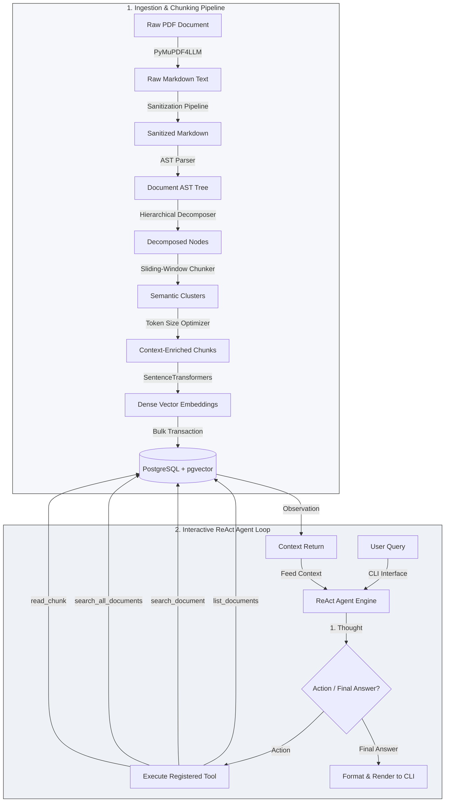

# Agentic RAG Pipeline: Personal Knowledge Operating System (PKOS)

A high-performance, production-grade Retrieval-Augmented Generation (RAG) pipeline featuring hierarchical document parsing, sliding-window semantic chunking, and an autonomous **Reason-and-Act (ReAct)** agent. Built on an asynchronous architecture with Python, PostgreSQL (`pgvector`), and Hugging Face `SentenceTransformers`, this system is optimized for processing complex literary texts, technical guides, and structured documents with high positional and contextual retention.

---

## 🚀 Resume-Ready Technical Highlights

If you are showcasing this project on your resume, here are the key engineering highlights:
- **Autonomous Agentic Decision Loop:** Developed a **ReAct (Reason-and-Act) agent** from scratch using system-prompt instructions. Implemented iterative reasoning loops, self-correction, and tool calls to resolve complex user queries.
- **Hierarchical Document Parsing (AST Engine):** Designed a custom line-by-line Markdown Abstract Syntax Tree (AST) parser that extracts sections, headers, tables, and lists. Implemented breadcrumb context propagation (`H1 > H2 > H3`) to prepend structural metadata directly to chunks, resolving lost-in-the-middle vector retrieval issues.
- **Sliding-Window Semantic Segmentation:** Built a dynamic boundary detector comparing contextual left and right sentence embedding windows. Detects topic shifts using a dynamic standard deviation threshold rather than fixed character limits, ensuring high semantic coherence.
- **Token Budget Optimization:** Integrated OpenAI’s `tiktoken` (`cl100k_base` tokenizer) to execute exact token-based segmenting and sliding overlaps. Prevents LLM context-window overflow and embedding truncation issues.
- **Asynchronous Vector Database with pgvector:** Configured a concurrent database access layer using **SQLAlchemy 2.0 (AsyncSession)** and **asyncpg**. Engineered SHA-256 content hashing for document deduplication and implemented native database-level cosine similarity queries using `pgvector`.
- **Comprehensive Quality Hardening:** Created a test suite containing **51 unit and integration tests** verifying sentence splitter edge-cases, AST tree backtracking, token budget boundary conditions, and database rollbacks.

---

## 📐 System Architecture & Dataflow

The diagram below illustrates the end-to-end processing pipeline, from document ingestion to agentic search and final answer generation.



---

## 🛠️ Detailed Component Deep Dive

### 1. Document Parsing & Text Sanitization Pipeline
- **Extraction:** Leverages `pymupdf4llm` to convert unstructured PDF documents into structural Markdown layout, preserving headers, tabular boundaries, and list hierarchies.
- **Sanitization:** Implements a multi-stage regex pipeline (`clean_extracted_text`) that filters out:
  - Recurring PDF page headers and Gutenberg license headers.
  - Page numbering artifacts (`X of Y` indicators).
  - Browser/system metadata (e.g., date stamps and PDF viewer footprints).
  - Project-specific URLs polluting the embedding space.

### 2. Hierarchical Document AST Parser (`app/engines/markdown_parser.py`)
- Standard flat chunking splits tables and lists in half, rendering them unreadable. The custom AST engine parses markdown lines into a tree structure composed of `DocNode` elements:
  - **Node Types:** `ROOT`, `HEADING`, `PARAGRAPH`, `TABLE`, `LIST`.
  - **Breadcrumb Context Path:** As the parser traverses down the tree, child nodes inherit their location. For example, a paragraph under Section 2.1 inherits the path `Context: Chapter 2 > Section 2.1`.
  - **Structural Preservation:** Tables are kept fully intact as atomic units; list items are aggregated into coherent list blocks rather than fractured across sentence splits.

### 3. Sliding-Window Semantic Boundary Detector (`app/engines/semantic_chunker.py`)
- Employs a context window comparison approach (comparing sliding windows of size $W$ on the left and right of every sentence split).
- Generates dense vector representations of the windows using `BAAI/bge-base-en-v1.5` (768 dimensions).
- Computes cosine distance ($1.0 - \text{CosineSimilarity}$) between the windows.
- Marks semantic boundaries dynamically at index points where:
  $$\text{Distance} > \mu_{\text{distances}} + (\text{threshold\_factor} \times \sigma_{\text{distances}})$$
- Applies minimum size constraints (`min_sentences` and `min_words`) to prevent creating fragment chunks from short paragraphs.

### 4. Token Budget Optimization (`app/utils/token_optimizer.py`)
- Integrates `tiktoken` (`cl100k_base` encoding) to calculate exact token sizes.
- Slices text blocks exceeding the `max_tokens` limit into multiple overlapping segments.
- Slides the window using a configurable `overlap_tokens` buffer to preserve continuity across boundaries.
- Employs defensive loops to prevent infinite splitting cycles on malformed text blocks.

### 5. Asynchronous Vector Database (`app/db/database_manager.py` & `retrieval_manager.py`)
- **Connection Management:** Uses SQLAlchemy's async engine to support concurrent API connections via `asyncpg`.
- **Vector Operations:** Connects directly with PostgreSQL’s `pgvector` extension.
- **Idempotency:** Generates a SHA-256 hash of the document's text body to prevent duplicate ingestion of identical files.
- **ACID Transactions:** Integrates error-handling rollbacks; all chunks are uploaded and committed in a single transactional block.
- **Scoped Similarity Search:** Executes cosine distance operations inside the database (`cosine_distance` operator) to fetch the top-$K$ results, supporting:
  - Scoped document queries (restricted to a single document).
  - Cross-document queries (joining `doc_chunks` and `files` to locate matching resources globally).

### 6. Agentic Decision Engine (`app/engines/agent_engine.py`)
- Implements a Reason-and-Act (ReAct) loop enabling multi-step queries:
  1. **Thought:** The agent reasons about the user's query and selects an action.
  2. **Action:** The agent executes one of the registered tools with a JSON payload.
  3. **Observation:** The system executes the tool and returns the raw results.
  4. **Loop:** Repeat steps 1–3 (up to `agent_max_iterations`) until sufficient information is collected.
  5. **Final Answer:** Generates a comprehensive answer citing document titles and chunk IDs.
- **Registered Tools:**
  - `list_documents()`: Lists all document titles and hash IDs in the database.
  - `search_document(query, file_id)`: Searches within a specific document. Automatically resolves the document name or hash ID.
  - `search_all_documents(query)`: Executes a global semantic search across the entire database.
  - `read_chunk(chunk_id)`: Fetches the raw text of a specific chunk. Allows the agent to inspect the source material in detail.

---

## 💻 Tech Stack & Libraries

- **Language:** Python 3.12
- **Vector Database:** PostgreSQL + `pgvector`
- **ORM / Driver:** SQLAlchemy 2.0 (Async) + `asyncpg`
- **Embeddings:** Hugging Face `SentenceTransformers` (`BAAI/bge-base-en-v1.5`, 768-dim)
- **Tokenization:** `tiktoken` (OpenAI cl100k_base)
- **PDF Extraction:** `pymupdf4llm`
- **CLI Interface:** `rich` (console tables, spinners, panels)
- **Testing:** `pytest` + `pytest-asyncio`
- **API Client:** `httpx` (async HTTP calls to LLM providers)
- **LLM Integrations:** Google Gemini API, local Ollama, and OpenAI-compatible APIs

---

## ⚙️ Installation & Local Setup

### 1. Prerequisites
- Python 3.12+
- PostgreSQL server (with `pgvector` installed)
  - *Note: On Ubuntu, you can install the extension with `sudo apt install postgresql-16-pgvector` or build it from source.*

### 2. Clone and Setup Environment
```bash
# Clone the repository
git clone <your-repo-url>
cd rag_python

# Initialize virtual environment
python3 -m venv .venv
source .venv/bin/activate

# Install dependencies
pip install -r requirements.txt
```

### 3. Database & LLM Environment Variables (`.env`)
Create a `.env` file in the root directory:
```env
# Database Credentials
DB_USER=postgres
DB_PASSWORD=password
DB_HOST=localhost
DB_PORT=5433
DB_NAME=tutorial_db

# Embedding settings
EMBEDDING_MODEL=BAAI/bge-base-en-v1.5
EMBEDDING_DIMENSION=768

# LLM API Provider (gemini / ollama / openai)
LLM_PROVIDER=gemini
LLM_API_KEY=your_gemini_api_key
LLM_MODEL=gemini-1.5-flash
LLM_TEMPERATURE=0.0
AGENT_MAX_ITERATIONS=5
```

---

## 🕹️ CLI Usage Guide

The pipeline is managed via the console utility `cli.py` with three subcommands: `ingest`, `query`, and `agent`.

### 1. Ingest a Document
Parses, sanitizes, segments, and uploads a PDF file into the database. Outputs a unique Document ID:
```bash
python3 cli.py ingest trialData/Peter-Pan.pdf
```

### 2. Standard Semantic Query
Retrieves the top-$K$ most similar text chunks for a specific document. The similarity score is mapped and colorized (green for strong matches, red for weak matches):
```bash
python3 cli.py query <document_id> "Why does Peter Pan refuse to grow up?" --top 3
```

### 3. Interactive Agent Session
Launches an interactive chat shell with the ReAct Agent. You can query across all documents simultaneously:
```bash
python3 cli.py agent
```

#### Example Agent Session log:
```
You: Who is Captain Hook and what happened to his hand?
Thinking...

Step 1 - Thought:
I need to find out who Captain Hook is and what happened to his hand. I will start by searching all documents for "Captain Hook hand".

Action: search_all_documents
Inputs: {"query": "Captain Hook hand"}
Observation: [
  {
    "chunk_id": "chk_38f29d",
    "document_title": "Peter-Pan",
    "text": "Context: Chapter 5 > The Crocodile\nContent: Hook is the captain of the Jolly Roger. He has a hook instead of a right hand. A crocodile bit off his hand and swallowed it...",
    "similarity_score": "87.42%"
  }
]

Step 2 - Thought:
I have found that Captain Hook is the captain of the Jolly Roger and he has a hook instead of his right hand because a crocodile bit it off. I have all the necessary information.

Final Answer:
Captain Hook is the pirate captain of the ship *Jolly Roger* (from the document "Peter-Pan"). His right hand was bitten off and swallowed by a crocodile (Chunk ID: chk_38f29d), which is why he now has a hook in its place.
```

---

## 🧪 Comprehensive Test Suite

The system maintains a test suite comprising **51 unit and integration tests** verifying critical pipeline behaviors.

### Run Tests
```bash
PYTHONPATH=. .venv/bin/pytest
```

### Coverage Areas
- **`test_pdf_extractor.py`:** Validates regex sanitization layers and mock PDF processing.
- **`test_markdown_parser.py`:** Checks line-by-line block creation, nested list structures, table boundaries, and parent-child AST links.
- **`test_semantic_chunker.py`:** Asserts sentence splits, dynamic threshold outliers, and zero-variance/empty-input safety guards.
- **`test_hierarchical_chunker.py`:** Verifies chunk structure generation and breadcrumb prepending.
- **`test_token_optimizer.py`:** Evaluates token slicing logic, window overlaps, and infinite loop protection.
- **`test_db_components.py`:** Tests database connections, duplicate document checks, and transaction rollback integrity.
