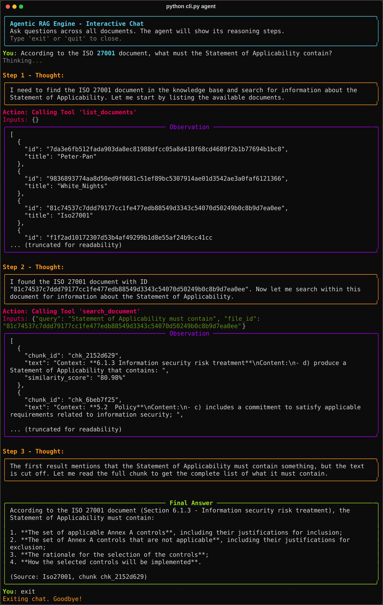
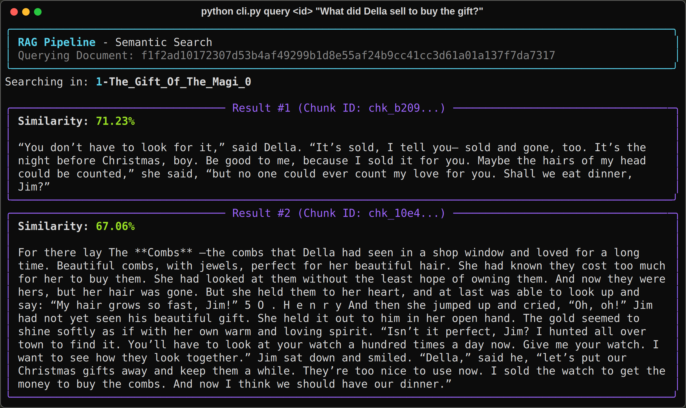
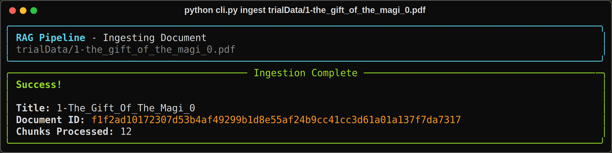
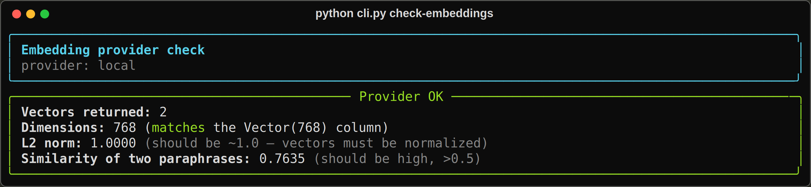
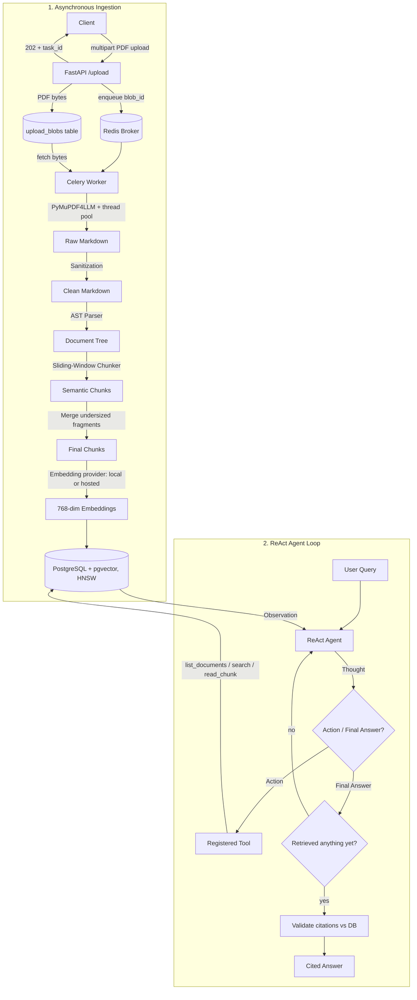

# Agentic RAG Pipeline

[](https://github.com/omega-sus67/rag_python/actions/workflows/ci.yml)

**Ask questions of your PDFs and get answers whose citations you can check.**

A Retrieval-Augmented Generation service built from scratch in Python — no LangChain.
Hierarchical PDF parsing, sliding-window semantic chunking, an async ingestion pipeline,
and a ReAct agent that is *structurally prevented* from answering without retrieving.

Runs locally in two commands — see [**Run it**](#run-it) — and every screenshot below is
real output from this code, not a mockup.

Every claim below is measured. Where the measurement was unflattering, it is reported anyway.

---

## See it run

**The agent answering from the corpus, showing its work.** Thought → Action → Observation,
three real tool calls, and an answer grounded in what it actually retrieved:



Worth looking at the second observation: `"Context: **6.1.3 Information security risk
treatment**"`. That prefix is the breadcrumb the hierarchical parser attaches to every
chunk, and it is why the agent could go straight from a vague question to the right
clause. The final answer cites `chk_2152d629` — a chunk id you can look up with
`cli.py` and read for yourself.

**Scoped semantic search**, with similarity scores on every hit:



**Ingestion** — parse, chunk, embed, store, in one command:



**Provider check.** Five seconds, and it catches a retired model, a wrong vector
dimension, or a revoked key before anything else does. All three happened:



---

## The two moments worth seeing

Both are cases where building the measurement exposed something the code had been getting
wrong silently.

### 1. The evaluation caught a bug that made retrieval worse

The custom semantic chunker is the centrepiece of this repo, so the first thing worth
knowing is whether it actually beats a naive baseline. The harness ingests the same corpus
twice — hierarchical semantic chunking vs **fixed 400-token windows with 100-token
overlap**, same embedding model, same pgvector search — and scores 18 hand-verified
questions across 4 documents.

The first run scored semantic chunking **well below** baseline. Inspecting the misses found
**688 near-empty chunks**, some a single character long, flooding the index: one-sentence
dialogue paragraphs slipped past the minimum-size guard, and short chunks embed deceptively
close to short queries. Merging undersized fragments lifted hit-rate@5 from 38.9% → 50.0%.

**That fix exists only because the evaluation exists.**

| Strategy | hit@1 | hit@3 | hit@5 | MRR |
|---|---|---|---|---|
| semantic (this repo) | 22.2% | 38.9% | **50.0%** | 0.312 |
| fixed-size baseline | 22.2% | 44.4% | **50.0%** | **0.347** |

And the honest reading: **the baseline still wins on MRR.** Aggregate parity, different
strengths — semantic wins on *Peter Pan* (3/7 vs 1/7), the baseline edges out ISO 27001.
A custom chunker that ties a 20-line baseline is a real result, and pretending otherwise
would make every other number here worth less.

### 2. The ReAct agent was not retrieving at all

The loop matched `Final Answer:` *before* `Action:` and returned immediately — so nothing
ever obliged the model to search. Two runs against the live corpus:

- Asked about *The Gift of the Magi*, it called `list_documents` (titles only), recognised
  the story, and answered **from training data** — getting it wrong: it said Della
  *received* the watch chain, when the chain is what she bought for Jim.
- Asked about ISO 27001 clause 6.1.3, a document the model has never seen, it made **zero
  tool calls** and invented a citation.

A retrieval system answering from parametric knowledge is not a retrieval system. The fix
is a **retrieval gate**: a final answer is rejected until a content-returning tool has
actually succeeded. `list_documents` deliberately does not count — it returns titles, and a
title is exactly what lets a model bluff.

Even then, **grounded prose and grounded citations turned out to be different problems.**
With retrieval working and the summary accurate, the agent cited 8 chunk IDs of which **2
did not exist** — fabricated in the same `chk_xxxxxxxx` shape as the real ones. So citations
are now verified against the database and unverifiable ones are reported as
`unverified_citations` rather than quietly shown.

```
Query: "What must the Statement of Applicability contain?"
  → 3 tool calls, grounded answer, 0 unverified citations

Query: "What is the capital of Australia?"        (not in the corpus)
  → searched, found nothing, and said so — instead of answering "Canberra" from memory
```

---

## Run it

### Locally, with Docker

```bash
cp .env.example .env          # defaults need no API key
docker compose up --build     # db, pgbouncer, redis, api, worker
# GPU machine? docker compose --profile gpu up --build

curl -F "file=@your-document.pdf" http://localhost:8000/upload   # 202 + task_id
curl http://localhost:8000/task/status/<task_id>
curl -X POST http://localhost:8000/agent/query \
     -H "Content-Type: application/json" \
     -d '{"query": "your question"}'
```

Ingestion and search need **no API key**. `EMBEDDING_PROVIDER=local` is the default and
downloads `bge-base-en-v1.5` on first use — the model the evaluation numbers were
measured with, so a clone reproduces them. Only the ReAct agent needs an LLM key, since
it has to talk to a model; set `LLM_API_KEY` and the three `LLM_*` values in `.env`
(Groq and Ollama both work — see `.env.example`).

### CLI

```bash
python cli.py ingest your-document.pdf                    # parse + chunk + embed + store
python cli.py query <document_id> "your question" --top 3 # scoped similarity search
python cli.py agent                                       # interactive ReAct chat
python cli.py evaluate-retrieval --markdown               # the benchmark above
python cli.py init-db                                     # idempotent schema bootstrap
python cli.py check-embeddings                            # verify a provider in 5 seconds
```

`check-embeddings` earned its place: it catches a retired model, a wrong vector dimension,
or a blocked API key *before* a deploy does. All three happened.

### About the evaluation corpus

`eval_dataset.json` ships — 18 hand-written questions with expected answer substrings —
but the PDFs it scores against do not. Three are public-domain Gutenberg texts
(*The Gift of the Magi*, *Peter Pan*, *White Nights*); the fourth is the ISO/IEC 27001
standard, which is copyrighted and not mine to redistribute. Drop them in `trialData/`
under the filenames in `eval_dataset.json` to reproduce the table above.

That is a real reproducibility gap and it is named rather than hidden: the harness and
the questions are auditable, the corpus is one you have to assemble.

### Tests

```bash
pytest tests/ -q      # 58 tests, no API key needed
```

Ruff + pytest run on every push via GitHub Actions.

---

## Architecture



**Why the PDF bytes go through Postgres.** Web and worker are separate containers with
separate filesystems in production, so passing a *file path* through the queue hands the
worker a path that does not exist. Compose hides this with a bind mount. The bytes cannot
ride the queue either — managed Redis free tiers cap at ~30 MB *total*, and a queue full of
PDF payloads evicts the queue. So Postgres carries the bytes, Redis carries a blob id, and
the worker deletes the row when it is done. Object storage is the better long-term answer;
this was the cheapest correct one.

---

## Deployment: built, measured, and deliberately not shipped

The service was deployed — Render + Neon (Postgres) + Redis Cloud, all free tiers — and
then taken down on purpose. [**deployment.md**](deployment.md) is the full record.

The reason is worth stating plainly, because it was a judgement call rather than a
failure to finish. `pymupdf4llm` needs a **~300 MB fixed working set** for layout
analysis — measured, and independent of document size: a 95-page PDF peaks *lower* than
a 26-page one, and batching pages changes nothing. Against plain text extraction on the
same document: **364 MB versus 51 MB** for 5% more text.

That does not fit a 512 MB container also running the API process. The only free
workaround was `PDF_PARSER=fast`, which trades the markdown headings away — and the
headings are what become the breadcrumb context paths visible in the agent screenshot
above. It produces **49 chunks where the structured parser produces 196, none carrying
context**, and it invalidates the retrieval numbers below, which were measured with
structured parsing.

A demo that quietly disables the hierarchical parsing is a worse artifact than no demo,
so the deployment work stayed and the URL went. `render.yaml` and the runbook are still
here; everything runs locally at full quality.

Getting it deployed in the first place meant clearing five blockers that local Docker
Compose was actively hiding.
**Compose was not a smaller version of production; it was a different architecture.**

| Blocker | What Compose hid |
|---|---|
| Connection URL assembled from 5 discrete fields | Managed Postgres gives *one* URL, carrying libpq-only params (`sslmode`, `channel_binding`) that **asyncpg rejects outright** |
| `create_tables()` issued `CREATE DATABASE` | Locally you are superuser; on Neon the database already exists and the role cannot create siblings |
| Web passed a **file path** through Redis | Compose bind-mounts `./data` into both containers, so the path resolved |
| `torch` + `sentence-transformers` ≈ 2.5 GB of wheels, ~1.5 GB resident | A laptop does not notice; a 512 MB container cannot start it |
| `/` returned a static string, port hardcoded | Nothing polls your laptop for health or reassigns its ports |

### Providers are pluggable because they had to be

Embeddings sit behind one seam. `local` runs sentence-transformers in-process for
development and evaluation; any OpenAI-wire-format API (**Jina**, Together, DeepInfra,
OpenAI) serves production without `torch` installed at all — which is what makes the worker
fit in a free-tier container.

This is not architectural taste. Mid-deployment the original embedding provider **retired
the model**, its replacement returned the **wrong vector dimension**, and then the account
was **blocked outright**. The generic provider exists because the next swap needed to be
free. The LLM side had the same property by accident — `llm.py` already spoke the OpenAI
format, so moving the agent to Groq was pure configuration.

---

## What broke in production, and what it taught

Each of these was invisible until something forced it into the open. They are the most
useful part of this repo.

**A health check that failed on every cold start.** The probe budget was 2.0s. A cold
connection to managed Postgres costs **2.008s** — TLS handshake plus endpoint wake, against
~0.6s warm. So the check failed immediately after every boot, and on a PaaS a failing health
check means the instance is killed and restarted: a loop that never stabilises. *Measure the
thing before you set a threshold on it.*

**The health endpoint exhausted the broker.** It opened a **new Redis connection per
request**. A health endpoint is the most-polled route on a service — the platform polls it,
a keep-warm pinger polls it again — so the cheapest endpoint became the one that ran a
30-client tier out of connections. Now one shared client: **10 connections idle, down from
~9 per worker.**

**Uploads vanished instead of failing.** Render OOM-killed the worker mid-ingestion. Celery
acknowledges a task *before* running it, so the task died with no result, no error, and no
retry — and `/task/status` reported `PENDING` forever, because Celery cannot distinguish
"queued" from "never existed". Fixed with `--pool=solo` (prefork forks a child and pays for
the interpreter twice inside 512 MB) plus `acks_late`, so a lost task is redelivered rather
than disappearing. **A silent disappearance is worse than a visible failure.**

**Partial ingestion left permanently un-ingestable documents.** `save_document()` commits the
metadata row, and only then does chunking run. Any failure after that point left a document
with zero chunks — invisible to search, and impossible to retry because the dedupe check
rejected every re-upload as a duplicate. Silent corruption, latent since the ingestion path
was written; local embeddings simply never failed. Now rolled back on failure.

**You cannot count tokens in someone else's tokenizer.** A 21k-character table measured
5,039 tokens under `tiktoken` — comfortably under the hosted API's 8,192 limit — and the API
rejected it anyway, because its tokenizer splits tables far more finely. Inputs are now
clipped in **characters**, the only unit every provider agrees on.

---

## Component deep dive

**Parsing** (`app/utils/pdf_extractor.py`) — `pymupdf4llm` converts PDFs to structural
Markdown. Documents over 20 pages are split into 50-page ranges converted **concurrently in
a thread pool** (MuPDF releases the GIL during layout analysis). A regex pipeline strips page
headers, `X of Y` numbers, timestamps and Gutenberg URLs before anything is embedded.

**Hierarchical AST** (`app/engines/markdown_parser.py`) — markdown becomes a tree of
`DocNode` elements. **Breadcrumb context paths** mean a paragraph under Section 2.1 carries
`Context: Chapter 2 > Section 2.1` into its chunk, so retrieval knows *where* text came from,
not just what it says. Tables stay atomic; list items aggregate instead of fracturing.

**Semantic chunker** (`app/engines/semantic_chunker.py`) — compares mean-pooled embedding
windows either side of each candidate split, and splits where cosine distance exceeds a
**per-document dynamic threshold** (μ + factor·σ) rather than a hardcoded number. A post-pass
merges undersized prose fragments — the fix the evaluation forced.

**Token budget** (`app/utils/token_optimizer.py`) — `tiktoken` enforces exact limits and
slices oversized blocks into overlapping segments. Doubles as the fixed-size baseline in the
evaluation.

**Vector store** (`app/db/`) — SQLAlchemy 2.0 async over `asyncpg`, **HNSW index**
(`m=16, ef_construction=200`, cosine) on the embedding column. Documents are keyed by the
SHA-256 of their extracted text, so duplicate uploads are rejected at the database level.
`pool_pre_ping` is on because Neon closes idle connections.

**ReAct agent** (`app/engines/agent_engine.py`) — Thought → Action → Observation over four
tools: `list_documents`, `search_all_documents`, `search_document` (title *or* hash id), and
`read_chunk`. Behind a retrieval gate and citation validation, as above.

---

## Known limitations

Named here because a gap you can point at beats one a reader finds.

- **The retrieval gate is blunt.** It requires *a* successful lookup, not a *relevant* one.
  An agent that searches badly, gets nothing useful, then answers from memory would still
  pass. The honest fix is grounding verification against the retrieved text.
- **Citation validation checks existence, not support.** A real chunk ID attached to a claim
  it does not support passes silently.
- **The hosted embedding switch has not been re-evaluated for quality.** The hit-rate and MRR
  figures were measured with `bge-base-en-v1.5`. Same dimension is not the same model, and
  those numbers should be re-run before being quoted alongside the deployment.
- **On fiction, PDF-to-markdown misdetects prose lines as headings**, so the breadcrumb paths
  that help on structured documents inject noise on novels.
- **512 MB is genuinely tight.** `--pool=solo` buys headroom but does not raise the ceiling;
  the pipeline holds all sentence and chunk embeddings in memory at once. A large PDF can
  still OOM the free tier.
- **No latency or throughput numbers yet.** Retrieval quality is measured; performance under
  concurrent load is not. That is the next piece of work, and claiming otherwise would be
  the same mistake this README exists to avoid.

---

## Layout

```
app/
  main.py              FastAPI: /upload, /task/status, /docFetch, /agent/query, /health
  worker.py            Celery app + the ingestion task
  controllers/         orchestration: parse -> dedupe -> chunk -> embed -> store
  core/config.py       pydantic-settings; every tunable
  core/llm.py          provider seam: gemini | ollama | any OpenAI-compatible
  db/                  models, HNSW index, schema bootstrap, retrieval
  engines/
    markdown_parser.py hierarchical AST
    semantic_chunker.py sliding-window boundary detection
    embeddings.py      local + hosted embedding providers
    agent_engine.py    the ReAct loop, retrieval gate, citation validation
  eval/                retrieval-quality harness
cli.py                 ingest / query / agent / evaluate / init-db / check-embeddings
deployment.md          the full deployment record
render.yaml            Render blueprint from the deployment described above
docs/screenshots/      the terminal captures at the top of this file
```

---

## Tech stack

Python 3.12 · FastAPI · Celery + Redis · PostgreSQL + pgvector (HNSW) · SQLAlchemy 2.0 async
+ asyncpg · sentence-transformers (`BAAI/bge-base-en-v1.5`) or any OpenAI-wire-format
embedding API · tiktoken · pymupdf4llm · Docker · GitHub Actions · pytest

## License

MIT
